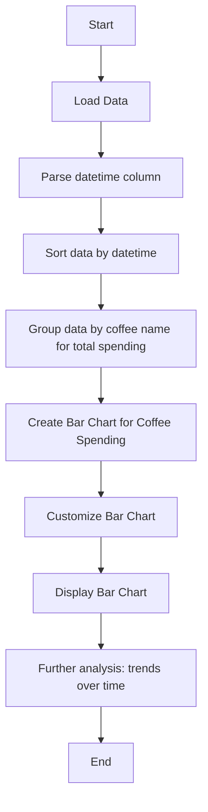

# Analyzing Coffee Data with Pandas and Visualizing Results with Matplotlib

## Objective for this Assignment:
- To load and analyze a dataset using the pandas library in Python.
- To create plots and charts with the matplotlib and seaborn libraries for visualizing the data.

## Submission Requirements
Submit a Jupyter notebook (.ipynb file) or Python script (.py file) containing:
- Data loading and exploration steps.
- Basic data analysis results.
- Visualizations.
- Findings or observations.

---

## Task 1: Load and Explore the Dataset

In this task, we loaded a dataset of coffee types and spending patterns to analyze customer behavior. The dataset contains the following columns:
- `coffee_name`: Type of coffee.
- `money`: Amount of money spent on that coffee.
- `datetime`: Date and time of purchase.

### Steps:
1. **Load the Dataset**: The dataset was loaded into a pandas DataFrame.
2. **Inspect Data**: We used `.head()` to display the first few rows and `.info()` to check data types and missing values.
3. **Data Cleaning**: The `datetime` column was converted to the appropriate datetime format using `pd.to_datetime()`. Missing values (if any) were handled by either filling or dropping them based on the analysis.

---

## Task 2: Basic Data Analysis

### Analysis Performed:
1. **Basic Statistics**: We computed the mean, median, and standard deviation of the `money` column using `.describe()`.
2. **Grouping by Coffee Type**: The data was grouped by `coffee_name` to calculate the total money spent per coffee type:
   ```python
   total_money_per_coffee = df.groupby('coffee_name')['money'].sum()
   ```
### Patterns and Observations:
Coffee types with higher spending indicated customer preference or premium pricing.
The total money spent on each coffee type provided insights into which products are more profitable.

# Task 3: Data Visualization
Visualizations Created:
We created the following visualizations to explore the data:

### Bar Chart: Comparison of total money spent on each coffee type.

This shows which coffee types generated the most revenue.
```python
plt.figure(figsize=(10, 6))
plt.bar(total_money_per_coffee.index, total_money_per_coffee.values, color='skyblue')
plt.title("Total Money Spent by Coffee Type")
plt.xlabel("Coffee Type")
plt.ylabel("Total Money Spent")
plt.xticks(rotation=45)
plt.grid(axis='y')
plt.tight_layout()
plt.show()
```
Line Chart: We could create a line chart to visualize the trend of money spent over time (based on the datetime column) for future analysis.

# Additional Instructions
## Dataset Suggestions:
You can use publicly available datasets from sources like Kaggle or UCI Machine Learning Repository.
The dataset used in this project contained coffee-related spending data.

## Plot Customization:
The visualizations were customized using matplotlib for labels, titles, and legends.
Seaborn was also used to enhance the visual style and make the charts more aesthetically pleasing.

## Error Handling:
We ensured the code handles any errors during data reading or conversion, using exception handling to manage missing or improperly formatted data.

# Key Insights:
Spending Patterns: The bar chart helped to identify which coffee types are most popular based on total spending.
Customer Preferences: By analyzing spending by coffee type, it was clear which types customers prefer more.
Data Trends: The analysis highlights the importance of grouping and aggregating data for deeper insights.

## Mermaid Diagram for Visualization Process:

```css
This structure provides a clear summary of the analysis, methods, and visualizations performed to explain the workflow and analysis done on the coffee dataset.
```
